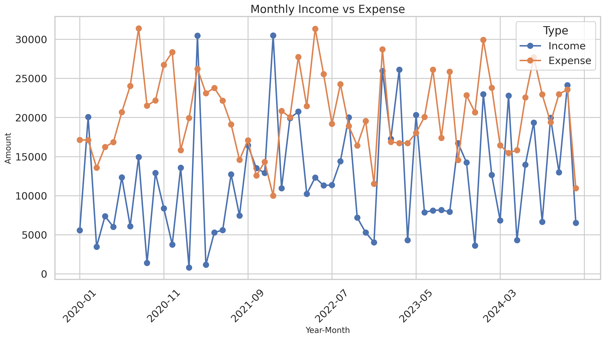
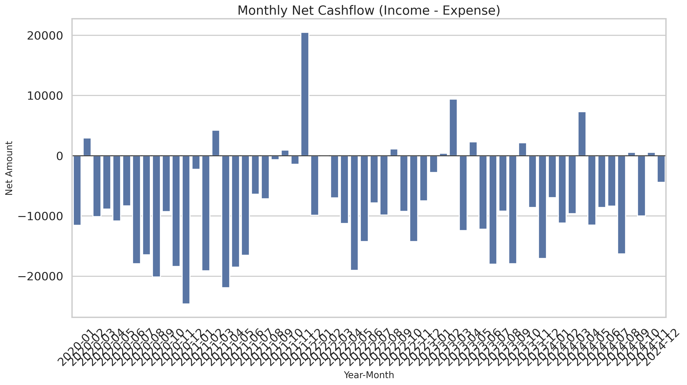
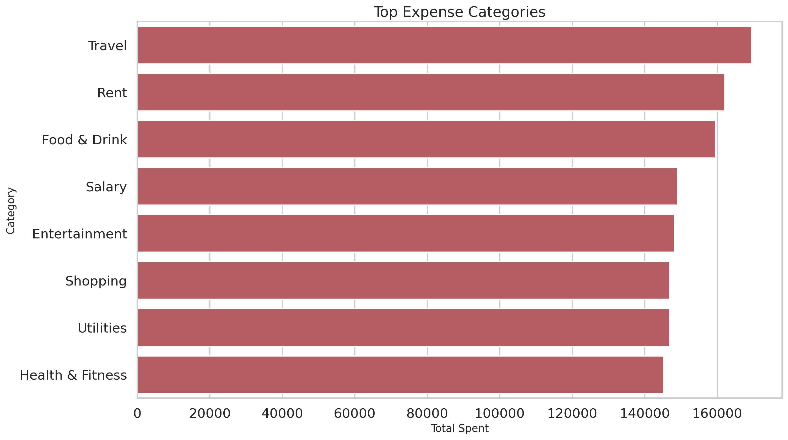
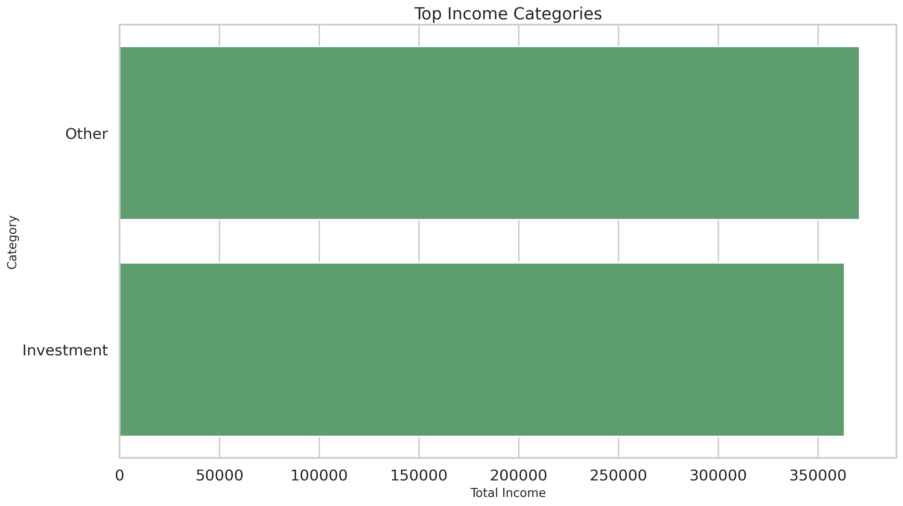
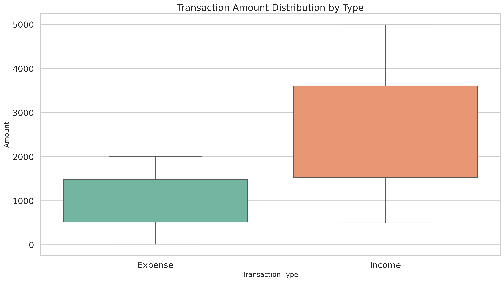
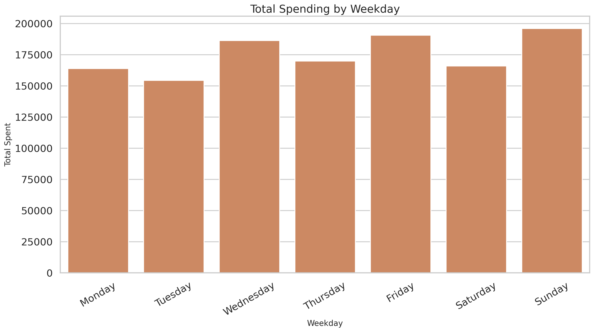
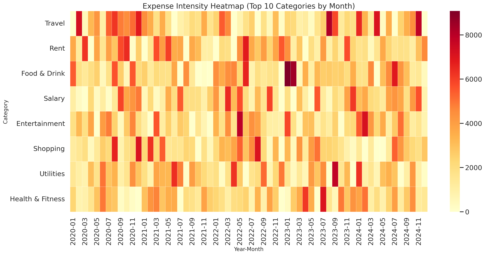

# Personal Finance EDA Story Report

A narrative summary of the exploratory data analysis across the personal finance dataset, covering cashflow, spending concentration, income structure, timing patterns, and the actions that matter most.

## Live project links

- **GitHub Pages:** [Add your live site link here](https://your-username.github.io/your-repo-name/)
- **Repository:** [Add your GitHub repo link here](https://github.com/your-username/your-repo-name)

---

## File structure

```text
personal finance EDA/
├── README.md
├── personal_finance.html
├── data/
│   └── Personal_Finance_Dataset.csv
├── notebook/
│   └── eda_personal_finance.py
└── visuals/
	├── 01_monthly_income_vs_expense.png
	├── 02_monthly_net_cashflow.png
	├── 03_top_expense_categories.png
	├── 04_top_income_categories.png
	├── 05_amount_distribution_by_type.png
	├── 06_spending_by_weekday.png
	└── 07_expense_heatmap_top_categories.png
```

> Virtual environment folders are intentionally excluded from this structure.

---

## At a glance

| Metric | Value |
|---|---:|
| Transactions analyzed | **1,500** |
| Date range | **2020-01-02** to **2024-12-29** |
| Total income | **734,087.00** |
| Total expense | **1,227,194.37** |
| Net cashflow | **-493,107.37** |
| Expense-to-income ratio | **167.17%** |
| Positive months | **12 / 60** |

> The central story is simple: spending materially and persistently outpaced income.

---

## 1. The big picture

Across five years of transactions, this budget was not merely tight — it was structurally imbalanced. Total expenses exceeded total income by **493,107.37**, and the expense-to-income ratio reached **167.17%**.

That means for every **1.00** earned, about **1.67** was spent.

This points to a system that would require depletion of savings, outside support, debt, or uncaptured income sources to remain sustainable.

### Visual: Monthly income vs expense



The monthly trend shows that expenses stayed dominant through most of the timeline, with only occasional periods where income caught up.

---

## 2. Cashflow momentum never stabilized

The net cashflow view makes the pattern sharper:

- **Best month:** **2021-12** with **20,485.34**
- **Worst month:** **2020-12** with **-24,613.12**
- **Positive months:** **12 out of 60** (**20.0%**)

A few good months existed, but they were too rare to offset the repeated deficits.

### Visual: Monthly net cashflow



The chart shows that most months ended below zero, which confirms that the issue was recurring behavior rather than a one-time shock.

---

## 3. Spending was concentrated enough to be actionable

The strongest spending driver was:

- **Top expense category:** **Travel** (**169,497.79**)

And the concentration was meaningful:

- **Top 3 expense categories accounted for 40.02% of total spending**

That matters because it means the budget is not only being eroded by many small transactions. A few categories are doing a disproportionate amount of damage.

### Visual: Top expense categories



If spending is going to improve quickly, these categories are the first place to intervene.

---

## 4. Income was concentrated too

Income was also narrow:

- **Top income category:** **Other** (**370,835.00**)
- **Top 3 income categories accounted for 100.00% of total income**

That concentration is not automatically a problem, but a dominant category named **Other** reduces clarity. It suggests that the inflow may depend on irregular or loosely labeled sources rather than clean, recurring streams.

### Visual: Top income categories



A budget with unstable or poorly classified income becomes harder to forecast, especially when spending is already elevated.

---

## 5. Transaction size mattered, not just transaction count

The distribution analysis shows that expense pressure came from both frequency and magnitude. Some transactions were large enough to distort entire months.

### Visual: Transaction amount distribution by type



The largest expenses all approached **2,000**, showing that outlier transactions had enough weight to materially worsen monthly performance.

---

## 6. Spending had a timing pattern

The weekday analysis adds a behavioral dimension: spending was not only large, but also patterned in time.

### Visual: Spending by weekday



This can be useful for setting weekly controls, review checkpoints, or alerts tied to recurring routines.

---

## 7. The pressure was persistent across categories and months

The heatmap shows that several top categories remained active over long stretches of time.

### Visual: Expense heatmap



This supports an important conclusion: the budget was not mainly being disrupted by isolated spikes. It was under recurring pressure from categories that stayed hot across the timeline.

---

## 8. High-value transactions worth monitoring

### Largest expenses

| Date | Category | Amount | Description |
|---|---|---:|---|
| 2020-08-22 | Food & Drink | 1,999.82 | Down occur. |
| 2020-11-12 | Food & Drink | 1,999.15 | Order his oil west school. |
| 2021-03-19 | Food & Drink | 1,997.19 | Across nothing. |

### Largest incomes

| Date | Category | Amount | Description |
|---|---|---:|---|
| 2024-04-10 | Investment | 4,996.00 | Environmental outside bed institution. |
| 2023-06-02 | Investment | 4,981.00 | Window career case south. |
| 2022-01-22 | Other | 4,975.00 | Best deal point. |

Outliers matter because a small number of large transactions can shape the outcome of an entire month.

---

## Key project files

- [README.md](README.md) — main written report and project overview
- [index.html](index.html) — polished story version for browser viewing and GitHub Pages
- [data/Personal_Finance_Dataset.csv](data/Personal_Finance_Dataset.csv) — source dataset
- [notebook/eda_personal_finance.py](notebook/eda_personal_finance.py) — analysis script that generates visuals and the report
- [visuals](visuals) — exported charts used in the story

This README is intended to be the main written report for the project, with `index.html` serving as the hosted presentation layer on GitHub Pages.

---

## Final takeaways

1. **Track and cap the biggest expense category first.** Travel offers the biggest savings leverage.
2. **Study the best month and replicate it.** The conditions behind **2021-12** are worth reverse-engineering.
3. **Set a monthly expense guardrail.** Spending should stay below a fixed percentage of income.
4. **Review large transactions weekly.** Outliers are powerful enough to cause silent budget drift.